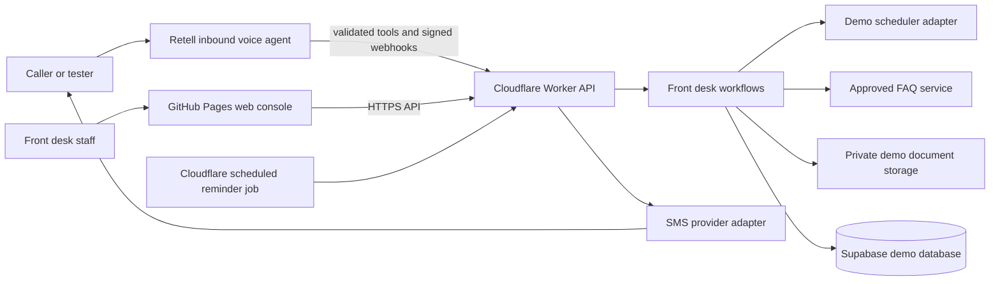

# AI Healthcare Front Desk — Architecture

**Status:** Draft for review  
**Version:** 0.1  
**Date:** 2026-10-03  
**Scope:** Architecture for the demo described in PRD.md. This is not a production clinical system.

## 1. Design goals

- Follow the working shape of the HVAC project to keep setup familiar and inexpensive.
- Keep the browser static and keep private API keys on the server.
- Use provider adapters so local mock behavior and live services share the same business rules.
- Make the demo scheduler and synthetic clinic data the first source of truth.
- Keep AI responsible for conversation, not authorization, scheduling rules, or clinical decisions.
- Support clinic market, language, and timezone as configuration.
- Make retries safe and keep all externally visible actions auditable.
- Avoid paid services until the local demo is useful; put budgets and feature flags around real calls and texts.

## 2. Proposed system view

An explorable diagram of the planned system is available at [architecture-diagram.html](architecture-diagram.html). It distinguishes the local mock demo from future provider connections.



The Retell agent is a conversation channel. It calls the same Worker operations used by the web console. It cannot write directly to the database or invent appointments. The Worker validates every requested operation and returns only the result needed for the next conversation turn.

## 3. Hosting and initial stack

| Concern | Proposed choice | Reason |
|---|---|---|
| Public web UI | React, Vite, TypeScript; GitHub Pages | Matches HVAC, static build, low hosting cost. Public source/site is intended for a portfolio demo with synthetic data. |
| CI and web deploy | GitHub Actions workflow on main and manual dispatch | Runs project checks, builds the UI, then deploys the static artifact, like HVAC. |
| Private API | Cloudflare Worker with TypeScript and Wrangler | Matches HVAC; holds API secrets, receives provider webhooks, and runs scheduled reminder checks. |
| Demo database | Separate Supabase project, PostgreSQL, SQL migrations, row-level security | Keeps this project isolated from HVAC and supports appointments, tasks, and status history. |
| Demo file storage | Private Supabase Storage bucket | Allows synthetic sample documents and private staff-only access through Worker endpoints. |
| Voice | Retell inbound phone agent | Uses the existing voice-agent provider and webhook pattern. |
| SMS | SmsProvider interface, provider selected after first pilot country is chosen | Avoids assuming one phone/SMS provider works in all named markets or has the lowest cost. Live sends are restricted to approved tester numbers. |
| Local development | Mock scheduler, mock Retell, mock SMS, local in-memory storage or local Supabase | No external account or call/text charge needed while building. |

### Important hosting boundary

GitHub Pages is for the static portfolio/demo UI, not the private API or a commercial clinic service. GitHub Free requires a public repository for Pages, and GitHub says Pages is not intended to run a commercial SaaS. Any real clinic deployment needs a different hosting and compliance plan. The Worker will never return private service credentials to the browser.

## 4. Component responsibilities

### Web application
- Shows public demo, staff console, fake appointments, FAQ editor, task queue, document status, and message outcomes.
- Owns no Retell key, Supabase service key, SMS credential, or storage secret.
- Sends requests to the Worker using public API routes.
- Formats timestamps with market locale and selected display timezone.
- Never fetches database tables directly.

Suggested packages and folders:

```text
apps/web/              React and Vite UI
apps/worker/           Cloudflare Worker, HTTP routes, webhooks, scheduled job
packages/shared/       Shared request/response schemas and public types
supabase/migrations/   Versioned schema and restricted database functions
supabase/seed/         Synthetic clinic, FAQ, schedule, and sample data
retell/                Voice-agent prompt, tools, and setup notes
docs/                  PRD, architecture, local setup, deployment, safety, FAQ
```

### Worker API
- Parses and validates all requests.
- Enforces clinic hours, timezone conversions, slot availability, booking rules, consent, test-number allowlist, rate limits, and message caps.
- Calls repository interfaces and provider adapters.
- Verifies Retell webhook signatures and rejects stale or repeated events.
- Redacts sensitive fields in logs.
- Uses stable request identifiers and idempotency keys for scheduling and messaging.
- Runs scheduled reminder/follow-up checks.
- Returns safe error categories and never exposes raw provider errors or private identifiers.

### Front desk domain services
- AppointmentService: availability, create, confirm, reschedule, cancel, waitlist.
- FAQService: find approved answer by locale and topic; return “no approved answer” when absent.
- HandoffService: callback request, unresolved question, staff queue.
- ReferralService: document checklist, private receipt, staff review state, follow-up task.
- ReminderService: eligibility, consent, quiet hours, timezone, deduplication, delivery state.
- ClinicConfigService: market, location, hours, services, providers, languages, timezone, disclosure text.
- DemoResetService: restore synthetic seed data without touching external user systems.

AI does not own these services. Retell tool calls must carry structured fields, and the Worker validates every field before performing an action.

### Provider adapters
Each adapter has a mock and a real implementation behind one interface:

- SchedulerProvider: demo database scheduler initially; future EHR or calendar adapter only after one is named.
- VoiceProvider: mock local calls and Retell live calls.
- SmsProvider: mock messages and selected live provider.
- DocumentStorage: local/mock receipt and private object storage.
- Clock/Timezone: deterministic clock in local flows and standards-based IANA timezone handling.

Provider creation is controlled by explicit environment modes, such as VOICE_MODE=mock and SMS_MODE=mock locally. Production configuration must fail closed if live mode is selected without the required secrets.

## 5. Main workflows

### 5.1 Inbound call and appointment booking

1. Caller reaches the selected Retell phone number.
2. Agent plays a reviewed AI/demo disclosure and confirms an enabled language.
3. Agent gathers the minimum administrative fields needed for the request.
4. Agent calls a Worker operation such as get_availability.
5. Worker validates the clinic, date, appointment type, timezone, and policy; reads availability from the demo scheduler.
6. Agent repeats the selected slot and asks for confirmation.
7. Agent calls create_appointment with an idempotency key.
8. Worker creates the appointment in a database transaction and returns confirmed or a safe failure.
9. Worker queues a confirmation text only if the phone is allowlisted and consent exists.
10. Retell call-end webhook records an opaque call event and a short summary. Recording and transcript persistence remain off unless explicitly approved.

### 5.2 Reschedule, cancel, waitlist

1. Match only a synthetic demo appointment using a booking reference plus a second non-sensitive demo verifier.
2. Read the current appointment and repeat it in the clinic timezone.
3. Confirm the requested change before writing.
4. For rescheduling, reserve the new slot and release the old one atomically.
5. For cancellation, update status and create a waitlist opportunity if enabled.
6. Record an audit event; send one confirmation after the successful database write.
7. If any step is uncertain, create a staff task instead of guessing.

### 5.3 Reminder and follow-up job

The current browser demo creates simulated message records: a booking confirmation, a 24-hour appointment reminder, and a missing-document follow-up scheduled 48 hours after booking. Rescheduling updates the reminder; cancelling an appointment or receiving the sample document cancels the corresponding simulated follow-up. These records never leave local browser storage.

For the later connected version:

1. A Cloudflare Cron Trigger runs on a short interval and queries a bounded batch of due jobs.
2. Worker converts each appointment instant to the clinic's IANA timezone and checks quiet hours.
3. Worker checks opt-in, opt-out, allowlist, status, and idempotency key.
4. Worker sends through SmsProvider or leaves the job blocked with a human-readable reason.
5. Worker stores provider message ID, outcome, attempt count, and safe error category.
6. Retries use the same idempotency key and a capped retry policy.
7. A missing-document follow-up is created once at the approved 48-hour point; it is cancelled if the document was received or appointment cancelled.

Cron expressions are stored in UTC; business decisions use the configured clinic timezone.

### 5.4 Referral and document intake

1. Worker returns only the checklist for the selected appointment type.
2. Browser uploads a file through an authenticated, short-lived upload token or Worker-proxied route.
3. Worker checks allowlisted file types, size, opaque document ID, and demo upload mode.
4. Object is stored in a private bucket; browser receives no public object URL.
5. Database stores an opaque object key, MIME type, size, timestamp, and status, not extracted medical meaning.
6. Staff marks received/incomplete; this updates the follow-up queue.
7. Scheduled cleanup deletes demo files and metadata per configured retention.
8. OCR/AI extraction is out of the first demo scope. If added later, it must be administrative metadata extraction only and reviewed by staff.

### 5.5 FAQ and human handoff

1. FAQ content is authored in the staff console and published only after review.
2. FAQ entries have locale, category, effective date, review date, and source.
3. Agent search returns only published entries for the active clinic and language.
4. Missing or stale answer leads to a staff task; no general model response is substituted.
5. Clinical content is outside the approved FAQ taxonomy and always follows the configured staff/emergency handoff.

## 6. Data design

Every row is scoped to a clinic. A tenant_id field prepares the model for more than one fictional clinic, but authentication and multi-clinic commercial use are not enabled in this demo.

| Entity | Purpose | Example fields |
|---|---|---|
| clinics | Fictional clinic settings | id, name, market, default_locale, default_timezone, demo_mode |
| locations | Addresses and instructions | clinic_id, address, parking, accessibility, phone |
| services | Administrative appointment types | name, duration, required_document_types, enabled |
| providers | Fictional staff schedule label | display_name, location_id, availability_rules |
| patients | Synthetic demo identity only | opaque_id, display_name, demo_reference, locale |
| appointments | Demo appointment state | patient_id, service_id, provider_id, start_utc, timezone, status |
| appointment_events | Change and confirmation history | appointment_id, event_type, actor, idempotency_key, created_at |
| waitlist_entries | Preferred ranges and offers | patient_id, service_id, requested_range, status |
| faq_articles | Approved answers | locale, category, answer, source, status, reviewed_at |
| call_sessions | Minimal call lifecycle and summary | opaque_call_id, locale, outcome, summary, created_at |
| followup_tasks | Staff work queue | task_type, due_at, status, owner, safe_summary |
| document_items | Private file metadata | opaque_id, object_key, MIME type, size, status, expiry |
| communication_preferences | Consent and suppression | patient_id, channel, consent_state, consent_at, opted_out_at |
| outbound_messages | Delivery/idempotency state | purpose, scheduled_at, status, provider_id, attempts |
| audit_events | Sensitive workflow change record | actor, action, target_id, created_at, safe metadata |

### Data handling rules

- Seed records and documents are invented. Demo data is visibly labeled.
- Avoid using phone numbers that belong to real people in seed data.
- Live tester contact details should be separated from synthetic patient records and deleted promptly.
- Do not store full payment card data, government identity numbers, insurance member numbers, diagnoses, or clinical notes.
- Never store audio by default. Keep call summary fields short, factual, and administrative.
- Use a private storage bucket, short-lived upload tokens, strict size/type limits, and scheduled deletion.
- Row Level Security is enabled. Browser roles have no direct access to private tables. Only the Worker has the server credential.
- Public API responses use opaque IDs and omit private contact, storage, and provider identifiers.
- Local development uses non-production credentials and fake providers.

## 7. Market, locale, and timezone model

Market and timezone are separate settings:

- Market controls phone rules, default locale, message templates, and market-level configuration.
- Clinic timezone controls opening hours, appointment slots, and reminder timing.
- Display timezone controls how a staff member or reviewer views an instant.

Store each appointment as an absolute UTC instant plus the IANA timezone used when booking. Keep the original timezone for audit/display context. Do not store a bare local wall-clock time as the only timestamp.

The UI should show the clinic time beside each booking. A reviewer can switch the displayed clinic/timezone for demo scenarios. Do not silently change an existing appointment when changing the selector. Changing a display timezone converts the same instant; changing a clinic timezone is an admin configuration change and must warn that future schedules/reminders will use the new setting.

Initial market and language values:

- USA: selectable IANA zones; English UI/voice; phone normalization and country-specific SMS setup.
- UAE: Asia/Dubai example; English UI/voice initially; other languages require review.
- Europe: country must be selected, then locale, timezone, phone and message rules follow that country. Do not treat Europe as one country.
- India: Asia/Kolkata example; English UI/voice initially; other languages require review.

All market-specific templates are configuration data, not prompt code.

## 8. API and event contracts

Example routes; exact names can change while implementing:

- GET /api/demo/config
- GET /api/demo/appointments
- POST /api/appointments/availability
- POST /api/appointments
- POST /api/appointments/:id/reschedule
- POST /api/appointments/:id/cancel
- POST /api/waitlist
- GET /api/faqs?locale=
- POST /api/handoffs
- GET /api/tasks
- POST /api/documents/upload-token
- POST /api/documents/complete
- GET /api/documents/:id/status
- GET /api/demo/messages
- POST /webhooks/retell
- POST /webhooks/sms-provider (only if delivery receipts require it)

Voice tool requests use shared typed schemas, strict allowlists, size limits, and request IDs. Webhooks verify provider signatures against the raw request body, reject replays, and acknowledge promptly. Inbound message routes must first apply STOP/opt-out handling before ordinary intent processing.

## 9. Identity, privacy, and abuse controls

For this demo:

- No public patient account or real identity proof is built.
- Appointment lookup uses fake booking references and demo-only verifiers.
- Public operations are rate-limited and use bot protection when live calls can be triggered from the site.
- Live calls/texts are disabled by default; enable only for approved tester numbers.
- Set maximum call length, calls per day, messages per day, upload limits, and provider spend alerts.
- Record explicit opt-in for each non-essential reminder channel. Support STOP and equivalent provider opt-out handling.
- Secrets live in local ignored files or Cloudflare secrets, never in Vite public variables or GitHub source.
- Logs include opaque IDs, status, duration, and error class only; do not log phone, message body, file name, transcript, or attachment URL.
- Use separate Supabase and Cloudflare resources from HVAC to isolate credentials and data.
- Production patient data, real clinics, legal notices, BAA/DPA, residency, retention, access management, backup, incident response, and compliance validation are explicitly outside this demo architecture.

## 10. Reliability and observability

- Structured, privacy-minimized Worker logs with request/correlation IDs.
- Idempotency on booking writes, webhook application, reminder creation, and send attempts.
- Unique database constraints prevent slot conflicts and duplicate reminders.
- Outbox pattern stores intended messages before sending; delivery status is separate from appointment status.
- Retry transient provider failures with capped backoff; do not retry permanent rejections indefinitely.
- Staff task is created when an action cannot be safely completed.
- Health endpoint returns service status without secrets or patient data.
- Simple dashboard shows job backlog, failed reminders, failed webhooks, and tasks requiring attention.
- Demo reset recreates synthetic data and must not trigger outbound calls/texts.

## 11. Repository layout and deployment

Proposed repository:

```text
ai-healthcare-front-desk/
  apps/web/
  apps/worker/
  packages/shared/
  supabase/migrations/
  supabase/seed/
  retell/
  docs/PRD.md
  docs/ARCHITECTURE.md
  docs/LOCAL_SETUP.md
  docs/DEPLOYMENT.md
  docs/SECURITY_AND_DEMO_BOUNDARIES.md
  .github/workflows/deploy-web.yml
```

Deployment follows HVAC:

1. The current GitHub Actions workflow installs locked dependencies and builds the static website.
2. It deploys only the static web artifact to GitHub Pages.
3. The next backend phase adds a Cloudflare Worker and Supabase migrations. Worker deployment remains a separate manual step, so a UI update cannot unexpectedly change the phone service.
4. Retell and SMS credentials are configured only after the backend, country, test-number allowlist, and setup guide are ready.
5. Local defaults remain fake providers and browser storage, with no outbound phone or SMS.

## 12. Cost plan

At the time this draft was prepared, official pricing pages list:

- GitHub Pages availability for public repositories on GitHub Free. Pages has a documented usage boundary and is not intended for commercial SaaS. See https://docs.github.com/en/pages/getting-started-with-github-pages/github-pages-limits
- Cloudflare Workers Free includes 100,000 requests per day, with limited CPU per invocation; paid Workers starts at $5/month. See https://developers.cloudflare.com/workers/platform/pricing/
- Supabase Free costs $0, includes 500 MB database and 1 GB storage, and may pause after a week of inactivity. See https://supabase.com/pricing
- Retell voice is usage-based and currently lists $0.07–$0.31/minute; phone-number and SMS fees depend on telephony setup. See https://www.retellai.com/pricing

Cost controls:

- Start with mock providers: $0 external call/SMS usage during local development.
- Keep public hosting and demo storage on free tiers while within limits.
- Use one live test number in one market only after code is ready.
- Configure small call and message caps; show the cap in setup docs.
- Do not purchase extra concurrency, knowledge-base add-ons, domain names, paid plans, or EHR access unless the owner approves the specific cost.
- Re-check provider and hosting prices immediately before live activation because pricing changes.

## 13. Architecture decisions and open questions

### Proposed decisions
- Separate repo and separate cloud resources from HVAC.
- Public code and static demo site, synthetic seed data.
- React/Vite/TypeScript + Cloudflare Worker + Supabase + Retell, consistent with HVAC.
- Demo scheduler as first backend, no EHR.
- Mock external services as the local default.
- Appointment confirmation, 24-hour reminder, and missing-document follow-up at 48 hours.
- Inbound voice first; browser UI manages the same workflows.
- English first across the selected markets.
- Clinic scheduling timezone and viewer display timezone are separate controls.
- Any live calls or texts must be restricted to the owner's approved test numbers.
- Booking confirmation, 24-hour appointment reminder, and a 48-hour missing-document follow-up.
- The first public version uses demo data and does not connect external providers.

### Open for the later live phase
- Which countries belong under the Europe market option.
- The first live pilot country and its phone/SMS provider.
- Which additional languages to review after English.
- Whether to allow synthetic file uploads in the public demo. The current demo tracks sample document status only and has no file upload.
- Recording/transcript policy and retention period for any live test contact data. Recording remains off by default.
- Whether a real EHR connection is in scope later, and which vendor if so.
- Confirm the public GitHub repository slug before creating the remote. The local project folder is `ai-healthcare-front-desk`.

## 14. References

- Existing HVAC architecture and deployment guide are the implementation pattern.
- GitHub Pages limits: https://docs.github.com/en/pages/getting-started-with-github-pages/github-pages-limits
- Cloudflare Workers pricing: https://developers.cloudflare.com/workers/platform/pricing/
- Cloudflare Cron Triggers: https://developers.cloudflare.com/workers/configuration/cron-triggers/
- Supabase pricing: https://supabase.com/pricing
- Retell pricing: https://www.retellai.com/pricing
- Retell telephony setup docs: https://docs.retellai.com/
