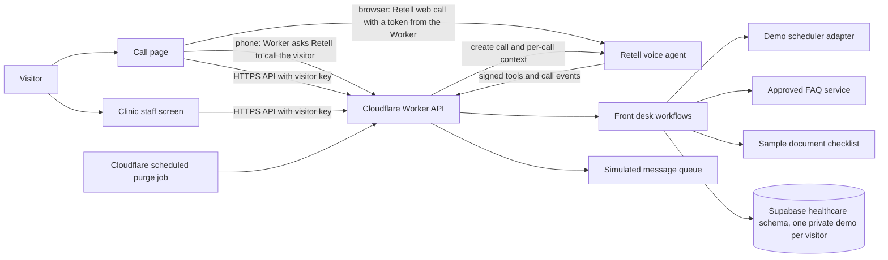

# AI Healthcare Front Desk — Architecture

**Status:** Implementation architecture
**Version:** 0.4
**Date:** 2026-10-06  
**Scope:** Architecture for the demo described in PRD.md. This is not a production clinical system.

**Implemented vs deployed.** This document describes the code on branch `feat/call-page`. The call page, private visitor demos, browser calls, and API version 3 are implemented and covered by the automated tests, but **none of them is deployed**. The live site still runs the previous version, which the rollout in [DEPLOYMENT.md](DEPLOYMENT.md) replaces step by step (each step needs the owner's approval). Parts marked "(not deployed)" below exist only in the code.

| Part | Live today | On the branch (not deployed) |
|---|---|---|
| Website | Console with a "Call me" panel; one shared demo clinic | Call page `#/`, clinic staff screen `#/staff`, private demo per visitor, browser calls |
| Worker | API version 2; shared snapshot; cron marks simulated texts delivered | API version 3; visitor workspaces; phone and browser calls; cron only purges |
| Database | Migrations `20261003000100`, `20261006000100` | Adds `20261007000100_healthcare_visitor_workspaces.sql` |
| Retell agent | Version 0, ten functions including `search_approved_faq` | Next version in `retell/`: `report_wrong_number` replaces `search_approved_faq` |

## 1. Design goals

- Follow the working shape of the HVAC project to keep setup familiar and inexpensive.
- Keep the browser static and keep private API keys on the server.
- Use provider adapters so local mock behavior and live services share the same business rules.
- Make the demo scheduler and synthetic clinic data the first source of truth.
- Keep AI responsible for conversation, not authorization, scheduling rules, or clinical decisions.
- Support clinic market, language, and timezone as configuration.
- Make retries safe and keep all externally visible actions auditable.
- Avoid paid services until the local demo is useful; put budgets and feature flags around real calls and texts.

## 2. System view

An explorable diagram is available at [architecture-diagram.html](architecture-diagram.html). The diagram shows the target system and has not been updated for the call page or private demos; the current build status below marks which parts are connected.

The diagram below shows the system on the branch (not deployed). The live system is the same without the call page: the console starts "Call me" calls and uses one shared demo clinic.



The Retell account is active. The Healthcare agent is published but has no phone number of its own and receives no inbound calls. On the call page, the Worker either calls the visitor from the shared demo number with this agent as a one-time override, or creates a browser call that the visitor joins with a short-lived token. The agent's signed custom-function routes act only for those Worker-started calls or for allowlisted owner numbers. Texts and reminders are simulated; no SMS provider is connected. The Worker validates demo records and never provides clinical decisions.

### Current implementation

- **Shared domain package.** `packages/shared/src` holds the fictional catalog, timezone helpers, the strict snapshot validator, patient-name rules and matching, slot search and reminder rules, the approved-FAQ lookup and its spoken versions, and `applyDemoAction` — the single function that performs every front-desk change. The browser, the Worker API, the Retell tools, and the reminder simulation all use it, so channels cannot drift apart.
- **Two screens on hash routes (not deployed).** `#/` is the call page and the default; `#/staff` is the clinic staff screen, loaded as its own chunk. An unknown hash opens the call page. Hash routes mean GitHub Pages needs no rewrite rules. The demo connection and the call controller live above the router, so moving to the staff screen neither reloads the clinic nor ends a browser call; a small "call in progress" bar shows on the staff screen.
- **Private demo per visitor (not deployed).** See "Private demos" below. Every change and every voice tool call acts on one visitor's own copy; the shared clinic is retired.
- **Server-authoritative writes.** In cloud mode the staff screen sends one action at a time to `POST /api/demo/actions` with an idempotency key. The Worker applies it to the latest copy of the visitor's demo inside an optimistic-concurrency loop (revision check, up to five attempts) and returns the saved copy. The screen updates only from that response, so it never shows a booking the server refused. The old whole-snapshot `PUT /api/demo/state` route is retired (HTTP 410).
- **Idempotency.** Record IDs are derived from the idempotency key (`stableId`). Replaying the same request returns the original result without writing; if that booking was since cancelled or moved, the same request is treated as a new booking instead of reporting the old one. Retell tools build the key from the call ID, the tool name, and the canonical action (timestamps re-parsed, names compared without case, accents, or punctuation), so a repeated tool call in one conversation cannot double-book. The staff screen uses one key per distinct choice in a dialog.
- **Exact confirmation.** Bookings and moves carry the provider that was shown; if that provider is no longer free the request is refused rather than silently given to another provider or location. One person cannot hold two overlapping visits (names are compared without case, accents, or punctuation).
- **Capacity.** Each private demo is bounded (see "Private demos"). When a list is full of open work, new requests are refused with a "reset the demo" message; open bookings, tasks, and pending texts are never deleted to make room. Read and write rate limits use separate per-client buckets.
- **Local mode.** If `VITE_API_BASE_URL` is empty, or the Worker is unreachable, has no database connection, or is older than API version 3, the website runs the same rules against a private copy in browser storage and says so on screen. Calls are off in this mode.
- The Worker uses a private `healthcare` schema in a separate free Supabase project. Its migrations are in `supabase/migrations/`; only server-side RPC functions are exposed to the Worker, and the browser never connects to Supabase. The call page release adds one migration (not applied; see [DEPLOYMENT.md](DEPLOYMENT.md)).
- Healthcare has a different Supabase key from HVAC. The earlier D1 migration is retained as deployment history. The application no longer reads or writes the D1 database.
- **Cron.** The Worker cron task (every 15 minutes) is the retention job: it deletes expired private demos and old call records (see "Private demos"). On the branch it no longer touches message records (not deployed); the live Worker's cron still marks due simulated texts as delivered. Simulated reminders now run in memory whenever a private demo is read and before every change, so no job has to visit every demo. The browser also applies them on its own clock. Nothing sends a text.
- Referral/document handling is a sample checklist and status change. No file upload, private file bucket, OCR, or real record is stored.
- The Healthcare Retell agent is published without a phone number of its own. Voice actions are accepted only for signed calls the Worker started (phone or browser) or from numbers in `RETELL_TEST_NUMBERS`; SMS remains simulation-only.

### Private demos (not deployed)

- **Visitor key.** The browser creates 32 random bytes (43 base64url characters) once and keeps them in `localStorage` under `caredesk-visitor-v1`. If storage is unavailable the key lives in memory and the demo ends with the tab. The key is sent as the `X-Demo-Visitor` header on every visitor route. A request without it gets `409 reload_required` (old open tabs are asked to reload); a malformed key gets `400 invalid_visitor`.
- **Workspace ID.** The Worker computes `workspace_id` as an HMAC-SHA256 of the key, keyed with a value derived from `SUPABASE_SECRET_KEY`. The raw key is never stored or logged. The demo is one row in `healthcare.visitor_workspaces`: the state JSON (at most 128 KB), a revision, `created_at` (its "generation", which tells the browser the demo was deleted and re-created), `last_used_at`, and whether it ever had a call.
- **Lazy creation.** Reading an unknown workspace returns a fresh seed (`persisted: false`, revision 0) and writes nothing. The first valid change, or a call request, stores the seed; the change is then applied with the normal read, apply, save (expected revision) loop. An invalid or no-op change never creates a row. `GET /api/demo/state?known=<generation>.<revision>` answers `{ unchanged: true }` without the state. The staff screen polls every 30 seconds, and every 3 seconds while a call runs (in any open tab, through a `BroadcastChannel`).
- **Retention.** A demo is deleted 7 days after its last use: a saved change, a call request, or a finished call. Reading does not extend it. **Delete my demo data** (`POST /api/demo/forget`, from the call page or Settings) deletes it at once, detaches its call records, and the browser then rotates its key; it is refused with `409 call_in_progress` while a call may be live. **Reset my demo** is the `reset_demo` action and reseeds the visitor's own copy.
- **Caps.** At most 3,000 demos and 150 MB of stored state in total. At the cap, the least recently used demo that never had a call is evicted; if none can be, new demos are refused ("The demo is busy"). At most 6 new demos per client per hour. A client is the full IPv4 address, or the /64 prefix of an IPv6 address. Per demo: 60 appointments, 60 tasks, 60 referrals, 120 messages, 40 waitlist entries, 60 events, 25 text preferences, and at most 20 distinct caller names.
- **Names.** A name is letters in any script, spaces, apostrophes, hyphens, and periods; it must contain a letter, has at most 60 characters and 5 words, and cannot contain digits or be "Front desk". All-lower or all-upper case becomes Title Case. New names can only come from voice calls: a staff-console action must use a sample patient or a name already in that demo, otherwise `400 unknown_patient`. Matching is tolerant of speech-recognition spelling: an exact match wins, then a unique first name, then a close spelling. When several people match, the tool returns the candidates and writes nothing.
- **Retired shared clinic.** The old `demo_state_snapshots` table and the first-generation call functions stay in the database, unused, until a later cleanup migration. A test checks that the Worker never calls them.
- **Accepted limit.** `localStorage` is shared by every page on `parshvak26.github.io`, so those pages (including the HVAC demo) can read the visitor key. It protects synthetic data and self-chosen names only.

### Demo calls (not deployed)

- **Two channels, one budget.** `POST /api/demo-call` starts a phone call (US +1 or India +91 number); `POST /api/demo-web-call` creates a browser call. Both need consent and a Cloudflare Turnstile token (hostname and action are checked). Order: validate, write rate limit, Turnstile, make sure the visitor's demo exists, reserve in the budget, call Retell, record the outcome.
- **Reservation.** One SQL function under an advisory lock checks, in order: the number is blocked after a wrong-number report (30 days); the browser already has a call that may be live; the same number was called in the last 30 minutes; the connection used its 3 calls in 24 hours; the 10 calls of the UTC day are used up. A call counts unless there is evidence it never connected (Retell refused it, or it ended with a connection error and never started). A call that never starts stops blocking the next one after 2 minutes but still counts. Owner numbers (`RETELL_TEST_NUMBERS`) skip the block, cooldown, and both limits, for phone calls only. See [DEPLOYMENT.md](DEPLOYMENT.md) for the exact rules and settings.
- **Phone call.** `POST /v2/create-phone-call` from the shared demo number with the Healthcare agent as `override_agent_id`, `override_agent_version` set from `RETELL_AGENT_VERSION` (an integer; `latest_published` when unset), and the reservation ID as the idempotency key.
- **Browser call.** `POST /v3/create-web-call` with `agent_id` and the same version rule. The access token lives about 30 seconds, so the browser asks for microphone permission first, then requests the call and starts it at once. The Retell client SDK (`retell-client-js-sdk` 3.0.2, with `livekit-client`) is a lazy chunk, prefetched when "Talk in browser" is shown. Web calls have no idempotency key; the one-active-call rule prevents double starts. If the browser cannot connect, `POST /api/demo-call/release` lets the visitor try again at once, but the call still counts. Leaving the page ends the call.
- **Per-call request.** Both channels send `metadata` (`source: healthcare-web-demo`, `request_id`, `workspace`, `channel`, `caller_timezone`, `placed_at`, `max_seconds`), an `agent_override` (maximum duration, the greeting, and — when `RETELL_EVENTS_URL` is set — `webhook_url` with events `call_started` and `call_ended`), and dynamic variables, all strings and none containing a name: `clinic_today`, `clinic_calendar` (next 14 days), `clinic_timezone_label`, `caller_status` (`new` or `returning`), `caller_booking_count`, `call_channel`, `caller_timezone`, `caller_time_differs`, `emergency_number`, `crisis_line`, `max_minutes`. A caller is "returning" when the private demo already holds a caller name; the greeting then asks who is speaking, and the agent finds bookings with `lookup_appointment`. Names stay out of metadata, variables, and the greeting so an injected name cannot be read aloud and Retell does not store it as a call attribute.
- **Status.** `GET /api/demo-call/status?ref=<callRef>` returns the phase (`ringing` for phone or `connecting` for browser, then `live`, then `ended`, or `unknown`), the outcome (`completed`, `time_limit`, `no_answer`, `blocked`, `error`), the tool timings, and the times. The reference must belong to the visitor's demo, otherwise 404. The source is the per-call `call_started` and `call_ended` events. With no `call_ended` yet, the Worker asks Retell's `GET /v2/get-call/{call_id}` at most once every 10 seconds per call. With no `call_started` 90 seconds after placing, the phase is `unknown`; for a phone call the page then suggests "Talk in browser".
- **Summary.** Built in the browser from the visitor's demo: activity events from the "Voice assistant" since the call was placed, joined with the appointment, waitlist request, or staff task they refer to. Nothing extra is stored, and no transcript is kept. The tool timing list ("Under the hood") holds only the tool name, duration, and success, at most 40 entries per call.
- **Trust.** Tool and event requests need a valid Retell signature and either an allowlisted owner caller, or the Healthcare agent ID with the metadata marker `source: healthcare-web-demo` and either a web call or an outbound phone call. Tools act on the demo named by the signed `workspace` and `request_id`. If that demo was deleted ("Delete my demo data"), the call record no longer links it and tools answer `success: false` ("session cleared") instead of re-creating it. Owner inbound test calls with no metadata use one fixed owner demo.
- **Wrong number.** The agent's `report_wrong_number` tool blocks the dialled number's keyed hash for 30 days. No number is stored. Browser calls have no number to block, and an owner number is never refused because of a block.
- **Time zone.** Voice tools always use the clinic zone (America/Chicago unless `CLINIC_TIMEZONE` is set) and ignore a `timezone` argument. Tool results carry a `spoken` time and, when the caller's zone differs, a `caller_time`, plus `seconds_left` so the agent can wrap up before the cap.
- **Switches.** `DEMO_CALLS` turns all calls off; `DEMO_WEB_CALLS` turns only browser calls off. Missing or malformed call settings turn calls off.

## 3. Hosting and initial stack

| Concern | Proposed choice | Reason |
|---|---|---|
| Public web UI | React, Vite, TypeScript; GitHub Pages; hash routes | Matches HVAC, static build, low hosting cost. Public source/site is intended for a portfolio demo with synthetic data. |
| CI and web deploy | GitHub Actions workflow on main and manual dispatch | Runs project checks, builds the UI, then deploys the static artifact, like HVAC. |
| Private API | Cloudflare Worker with TypeScript and Wrangler | Matches HVAC; holds API secrets, receives provider webhooks, and runs a scheduled job (on the branch it only purges expired demo data; the live Worker's job also marks simulated texts delivered). |
| Demo database | Dedicated Supabase free project with private `healthcare` schema; one private demo per visitor | Keeps the healthcare tables and service key separate from HVAC. |
| Demo file storage | Not connected | The current public demo stores sample document status only; it does not upload files. |
| Voice | Retell voice agent: outbound phone calls to visitors and browser (web) calls; no inbound number | Uses the existing voice-agent provider and webhook pattern. The Worker starts every call, so it controls the budget and the per-call context. |
| SMS | SmsProvider interface, provider selected after first pilot country is chosen | Avoids assuming one phone/SMS provider works in all named markets or has the lowest cost. Live sends are restricted to approved tester numbers. |
| Local development | Mock scheduler, mock Retell, mock SMS, browser local storage | No external account or call/text charge needed while building. |

### Important hosting boundary

GitHub Pages is for the static portfolio/demo UI, not the private API or a commercial clinic service. GitHub Free requires a public repository for Pages, and GitHub says Pages is not intended to run a commercial SaaS. Any real clinic deployment needs a different hosting and compliance plan. The Worker will never return private service credentials to the browser.

## 4. Component responsibilities

### Web application
- Two screens: the call page (`#/`) and the clinic staff screen (`#/staff`). The call page has the phone and browser call forms (consent and Turnstile), live call status, the summary, "Try saying" ideas, and **Delete my demo data**. The staff screen shows fake appointments, the FAQ test box, task queue, document status, and message outcomes.
- Owns no Retell key, SMS credential, or storage secret. The only provider code in the browser is the public Turnstile widget and the Retell client SDK, which joins a call with a token the Worker obtained.
- Keeps the visitor key and sends it as `X-Demo-Visitor`; sends requests to the Worker using public API routes.
- Formats timestamps with market locale and selected display timezone; "My display time" starts at the viewer's own zone.
- Never fetches database tables directly.

Suggested packages and folders:

```text
apps/web/              React and Vite UI
apps/worker/           Cloudflare Worker, HTTP routes, webhooks, scheduled job
packages/shared/       Shared domain rules, request/response schemas and public types
supabase/migrations/   Versioned healthcare database migrations
cloudflare/migrations/ Retained D1 migration history from initial deployment
retell/                Voice-agent prompt, tools, and setup notes
docs/                  PRD, architecture, local setup, deployment, safety, FAQ
```

### Worker API
- Parses and validates requests, checks names and references, checks timezone validity, and rate-limits public demo routes.
- Provides sample availability and Retell tool operations for booking, rescheduling, cancellation, waitlist, document status, staff follow-up, and wrong-number reports. It still answers the old FAQ lookup tool for older agent versions.
- Starts phone and browser calls, applies the shared call budget, and reports call status (see "Demo calls").
- Verifies Retell webhook signatures and restricts voice actions to calls it started or to configured owner numbers.
- Saves a bounded synthetic copy of each visitor's demo using revision checks. The browser never receives database credentials.
- Runs a scheduled retention job that deletes expired private demos and old call records. Sample reminders are simulated when a demo is read or changed, not by the job.
- Returns generic error messages rather than provider response details.

### Front desk domain services
- AppointmentService: availability, create, confirm, reschedule, cancel, waitlist.
- FAQService: find approved answer by locale and topic; return “no approved answer” when absent.
- HandoffService: callback request, unresolved question, staff queue.
- ReferralService: document checklist, private receipt, staff review state, follow-up task.
- ReminderService: eligibility, consent, quiet hours, timezone, deduplication, delivery state.
- ClinicConfigService: market, location, hours, services, providers, languages, timezone, disclosure text.
- DemoResetService: restore synthetic seed data without touching external user systems.

AI does not own these services. Retell tool calls must carry structured fields, and the Worker validates every field before performing an action.

### Provider adapters
Each adapter has a mock and a real implementation behind one interface:

- SchedulerProvider: demo database scheduler initially; future EHR or calendar adapter only after one is named.
- VoiceProvider: mock local calls and Retell live calls.
- SmsProvider: mock messages and selected live provider.
- DocumentStorage: local/mock receipt and private object storage.
- Clock/Timezone: deterministic clock in local flows and standards-based IANA timezone handling.

Provider creation is controlled by explicit environment modes, such as VOICE_MODE=mock and SMS_MODE=mock locally. Production configuration must fail closed if live mode is selected without the required secrets.

## 5. Main workflows

### 5.1 Demo call and appointment booking

The visitor starts the call from the call page; nobody dials in. (Implemented, not deployed. The live site starts "Call me" calls from the console in the same way, against the shared clinic.)

1. The visitor chooses "Call my phone" or "Talk in browser", agrees to the call, and passes the security check.
2. The Worker validates the request, makes sure the visitor's private demo exists, reserves the call in the shared budget, and asks Retell to start it with per-call context (dates, calendar, new or returning caller, time zone, emergency number) and the greeting. A phone call rings the visitor from the shared demo number; a browser call joins with a short-lived token.
3. Retell reports `call_started`; the call page shows the call as live.
4. Agent plays the greeting, which says it is an AI and a demo, and gathers the minimum administrative fields needed for the request, including any name the caller chooses.
5. Agent calls a Worker operation such as get_availability. The Worker validates the date range, appointment type, and policy; reads availability from the visitor's private demo; and returns at most three spread-out options as spoken times.
6. Agent repeats the selected slot and asks for confirmation.
7. Agent calls create_appointment. The idempotency key comes from the call ID and the canonical request.
8. Worker applies the booking to the visitor's demo with a revision check and returns confirmed or a safe failure. The agent says "booked" only when the result has `success: true`.
9. Worker records a simulated confirmation text (and, for new patient visits and consultations, the document items). No text is sent.
10. Retell reports `call_ended`. The Worker stores the call ID, the event, Retell's disconnection reason, and the time. The call page builds its summary in the browser from the changes the voice assistant made. Recording and transcript persistence remain off.

### 5.2 Reschedule, cancel, waitlist

1. Match only a synthetic demo appointment using a booking reference plus a second non-sensitive demo verifier.
2. Read the current appointment and repeat it in the clinic timezone.
3. Confirm the requested change before writing.
4. For rescheduling, reserve the new slot and release the old one atomically.
5. For cancellation, update status and create a waitlist opportunity if enabled.
6. Record an audit event; send one confirmation after the successful database write.
7. If any step is uncertain, create a staff task instead of guessing.

### 5.3 Reminder and follow-up job

The demo creates simulated message records: a booking confirmation, a 24-hour appointment reminder (skipped when the visit is less than a day away), and — for new patient visits and consultations — one missing-document follow-up 48 hours after booking (skipped if the visit comes first). Every simulated text is moved out of quiet hours (before 9 AM or after 8 PM clinic time) and is recorded as `Suppressed (opt-out)` for a patient who has replied STOP. Rescheduling moves the reminder; cancelling an appointment, recording a missed visit, or receiving the sample document cancels the matching pending texts. The reminder simulation re-checks opt-out, cancellation, and document status at delivery time. With no API URL configured, records stay in the browser and the same simulation runs there. When the Worker is configured, the simulation runs in memory whenever a private demo is read and before every change, and the scheduled job does not touch messages (not deployed; the live Worker's job still delivers due texts for the shared clinic). Messages remain simulations in either mode.

For the later connected version:

1. A Cloudflare Cron Trigger runs on a short interval and queries a bounded batch of due jobs.
2. Worker converts each appointment instant to the clinic's IANA timezone and checks quiet hours.
3. Worker checks opt-in, opt-out, allowlist, status, and idempotency key.
4. Worker sends through SmsProvider or leaves the job blocked with a human-readable reason.
5. Worker stores provider message ID, outcome, attempt count, and safe error category.
6. Retries use the same idempotency key and a capped retry policy.
7. A missing-document follow-up is created once at the approved 48-hour point; it is cancelled if the document was received or appointment cancelled.

Cron expressions are stored in UTC; business decisions use the configured clinic timezone.

### 5.4 Referral and document checklist

The current build uses sample names, document labels, and receipt-status changes. It does not accept or retain file contents. Private uploads, deletion schedules, and OCR are later work and must remain limited to synthetic test files if added.

### 5.5 FAQ and human handoff

1. FAQ content is authored in the staff console and published only after review.
2. FAQ entries have locale, category, effective date, review date, and source.
3. The agent uses only the approved answers in its prompt (spoken versions generated from the same catalog, and a test keeps them in sync). It has no search tool in the next agent version; the Worker still answers `search_approved_faq` for older versions.
4. Missing or stale answer leads to a staff task; no general model response is substituted.
5. Clinical content is outside the approved FAQ taxonomy and always follows the configured staff/emergency handoff.

## 6. Data design

Every row is scoped to a clinic. A tenant_id field prepares the model for more than one fictional clinic, but authentication and multi-clinic commercial use are not enabled in this demo.

| Entity | Purpose | Example fields |
|---|---|---|
| clinics | Fictional clinic settings | id, name, market, default_locale, default_timezone, demo_mode |
| locations | Addresses and instructions | clinic_id, address, parking, accessibility, phone |
| services | Administrative appointment types | name, duration, required_document_types, enabled |
| providers | Fictional staff schedule label | display_name, location_id, availability_rules |
| patients | Synthetic demo identity only | opaque_id, display_name, demo_reference, locale |
| appointments | Demo appointment state | patient_id, service_id, provider_id, start_utc, timezone, status |
| appointment_events | Change and confirmation history | appointment_id, event_type, actor, idempotency_key, created_at |
| waitlist_entries | Preferred ranges and offers | patient_id, service_id, requested_range, status |
| faq_articles | Approved answers | locale, category, answer, source, status, reviewed_at |
| call_sessions | Minimal call lifecycle and summary | opaque_call_id, locale, outcome, summary, created_at |
| followup_tasks | Staff work queue | task_type, due_at, status, owner, safe_summary |
| document_items | Private file metadata | opaque_id, object_key, MIME type, size, status, expiry |
| communication_preferences | Consent and suppression | patient_id, channel, consent_state, consent_at, opted_out_at |
| outbound_messages | Delivery/idempotency state | purpose, scheduled_at, status, provider_id, attempts |
| audit_events | Sensitive workflow change record | actor, action, target_id, created_at, safe metadata |

### What the demo build stores (not deployed)

The table above is the target model. The demo keeps the records it uses (appointments, waitlist entries, staff tasks, referral items, simulated messages, change history, and text preferences) as one validated JSON state per private demo, not as separate tables. Clinic settings, services, providers, and the FAQ catalog are code in the shared package. The healthcare schema holds:

| Table | Holds | Kept for |
|---|---|---|
| `visitor_workspaces` | One private demo: state JSON (at most 128 KB), revision, created and last-used times, whether it had a call. Keyed by an HMAC of the visitor's browser key. | 7 days after last use, or until "Delete my demo data" |
| `demo_call_requests` | One row per call request: channel, outcome, the request time, keyed hashes of the phone number (phone calls only) and of the connection, the demo it was made for, a short tool timing log (tool name, milliseconds, success), and a wrong-number block date. | Link to the demo cleared 1 hour after the call ended (2 hours after the request at the latest); phone hash cleared after 24 hours unless the number is blocked (blocks last 30 days); row deleted after 30 days |
| `retell_call_events` | Retell call ID, event name (`call_started`, `call_ended`), Retell's disconnection reason, and the time. No transcript or audio. | 30 days |
| `demo_rate_limits` | Counters for the per-client read, write, and new-demo limits, keyed by a keyed hash of the connection. | About a day |

`demo_state_snapshots` (the retired shared clinic) and the first-generation call functions remain in the database, unused, until a later cleanup migration. On the live system today the shared clinic in `demo_state_snapshots` is the only demo.

### Data handling rules

- Seed records and documents are invented. Demo data is visibly labeled.
- The only free text a visitor can put into a demo is a caller name, which the validator limits to letters, spaces, apostrophes, hyphens, and periods. Names come from voice calls and are stored only in that visitor's demo.
- Avoid using phone numbers that belong to real people in seed data.
- Live tester contact details should be separated from synthetic patient records and deleted promptly.
- Do not store full payment card data, government identity numbers, insurance member numbers, diagnoses, or clinical notes.
- Never store audio by default. Keep call summary fields short, factual, and administrative.
- Use a private storage bucket, short-lived upload tokens, strict size/type limits, and scheduled deletion.
- The Supabase secret stays in the Worker secret store. Private tables have no client-role grants; the Worker uses narrowly scoped service-role RPC functions.
- Public API responses use opaque IDs and omit private contact, storage, and provider identifiers.
- Local development uses non-production credentials and fake providers.

## 7. Market, locale, and timezone model

Market and timezone are separate settings:

- Market controls phone rules, default locale, message templates, and market-level configuration.
- Clinic timezone controls opening hours, appointment slots, and reminder timing.
- Display timezone controls how a staff member or reviewer views an instant.

Store each appointment as an absolute UTC instant plus the IANA timezone used when booking. Keep the original timezone for audit/display context. Do not store a bare local wall-clock time as the only timestamp.

The UI should show the clinic time beside each booking. A reviewer can switch the displayed clinic/timezone for demo scenarios. Do not silently change an existing appointment when changing the selector. Changing a display timezone converts the same instant; changing a clinic timezone is an admin configuration change and must warn that future schedules/reminders will use the new setting.

Initial market and language values:

- USA: selectable IANA zones; English UI/voice; phone normalization and country-specific SMS setup.
- UAE: Asia/Dubai example; English UI/voice initially; other languages require review.
- Europe: country must be selected, then locale, timezone, phone and message rules follow that country. Do not treat Europe as one country.
- India: Asia/Kolkata example; English UI/voice initially; other languages require review.

All market-specific templates are configuration data, not prompt code.

## 8. API and event contracts

Routes in the Worker on the branch (API version 3, reported by `/api/health`; not deployed). The live Worker is version 2 and still serves one shared clinic. Every route except health, the FAQ list, and the webhooks needs the `X-Demo-Visitor` header (see "Private demos").

- `GET /api/health` — status, `apiVersion`, database reachability, `liveSmsEnabled: false` (hard-wired), and `liveCallsEnabled` (true only when every call setting is valid). `demoCalls` reports whether calls are on (`enabled`), the countries, the demo number, the minutes per call, the daily limit, and `web.enabled` for browser calls. `privateDemo.retentionDays` is 7.
- `GET /api/demo/state` — the visitor's own demo, its revision, its generation, and whether it is saved yet. With `?known=<generation>.<revision>` it answers `{ unchanged: true }` when the browser is current.
- `POST /api/demo/actions` — `{ idempotencyKey, action }`, where `action.type` is one of `book_appointment`, `reschedule_appointment`, `cancel_appointment`, `confirm_appointment`, `record_attendance`, `join_waitlist`, `cancel_waitlist`, `mark_document_received`, `create_task`, `update_task`, `set_sms_preference`, or `reset_demo`. Returns the saved copy and a result message. Unknown fields are rejected.
- `POST /api/appointments/availability` — open slots for a date, appointment type, and clinic timezone, in the visitor's demo.
- `POST /api/demo/forget` — deletes the visitor's demo ("Delete my demo data"); `409 call_in_progress` while a call may be live.
- `POST /api/demo-call` — `{ phoneNumber, consent: true, turnstileToken, timezone? }`. Starts a phone call (see "Demo calls").
- `POST /api/demo-web-call` — `{ consent: true, turnstileToken, timezone? }`. Creates a browser call and returns its short-lived token. `503 web_calls_off` when browser calls are off (`DEMO_WEB_CALLS` is not `on`, or `RETELL_EVENTS_URL` is missing).
- `GET /api/demo-call/status?ref=<callRef>` — call phase, outcome, and tool timings.
- `POST /api/demo-call/release` — `{ callRef }`. Frees a browser call that could not connect.
- `GET /api/faqs` — the approved FAQ list (no visitor key needed).
- `PUT /api/demo/state` — retired; always `410`.
- `POST /webhooks/retell/custom-function` — signed Retell tools: `get_availability`, `create_appointment`, `lookup_appointment`, `confirm_appointment`, `reschedule_appointment`, `cancel_appointment`, `join_waitlist`, `request_staff_followup`, `check_document_status`, and `report_wrong_number`. `search_approved_faq` is still answered for older agent versions.
- `POST /webhooks/retell/events` — signed `call_started` and `call_ended` events; stores only the opaque call ID, the event name, Retell's disconnection reason, and the time.

Limits and headers: JSON request bodies are limited to 16 KB (webhook bodies to about 512 KB for tools and 1 MB for events). Each client has separate per-minute buckets, 120 reads and 30 writes, answered with `429` and `Retry-After`. Browser requests are accepted only from the origins in `PUBLIC_ORIGINS`; the Worker answers CORS preflights, allows `Content-Type`, `X-Request-Id`, and `X-Demo-Visitor`, and sends `Cache-Control: no-store` on every response. Errors have the form `{ error: { code, message } }`.

Tools act only for calls the Worker itself started (signed request, Healthcare agent ID, and the `healthcare-web-demo` metadata marker, which only API-key holders can set; phone calls must be outbound) or for calls from allowlisted owner numbers. Retell shows the agent only the HTTP status of a non-2xx response, so business outcomes (slot taken, booking not found) are returned as HTTP 200 with `success: false` and a message the agent can act on. Signature and allowlist failures stay 401/403.

File upload, SMS-provider webhooks, user authentication, and real clinic administration are not implemented. The demo waitlist is synthetic and only creates a staff follow-up when a matching appointment is cancelled or moved.

Voice tool requests use shared typed schemas, strict allowlists, size limits, and request IDs. Webhooks verify provider signatures against the raw request body and reject signatures whose timestamp is more than 5 minutes old. Inbound message routes (not built) must first apply STOP/opt-out handling before ordinary intent processing.

## 9. Identity, privacy, and abuse controls

For this demo:

- No public patient account or real identity proof is built.
- Appointment lookup uses fake booking references and demo-only verifiers.
- Public operations are rate-limited, and calls are protected by a Cloudflare Turnstile check.
- Visitor calls (phone and browser) need the visitor's consent and the Turnstile check, and share one daily budget and per-connection, per-number, and per-browser limits (see "Demo calls"). `DEMO_CALLS` and `DEMO_WEB_CALLS` switch them off at once, and missing or malformed call settings turn them off. Owner numbers (`RETELL_TEST_NUMBERS`) are exempt from the phone limits only. Texts are simulated; no text is sent.
- A number that is reported as a wrong number is blocked for 30 days. The Worker keeps only keyed hashes of the number and the connection, for the limits and the block (see "What the demo build stores"). It stores no phone number, transcript, or audio.
- Set maximum call length, calls per day, upload limits, and provider spend alerts. Message limits apply when a text provider is added.
- Record explicit opt-in for each non-essential reminder channel. Support STOP and equivalent provider opt-out handling.
- Secrets live in local ignored files or Cloudflare secrets, never in Vite public variables or GitHub source.
- Logs include opaque IDs, status, duration, and error class only; do not log phone, message body, file name, transcript, or attachment URL.
- Use separate Cloudflare resources from HVAC to isolate demo data.
- Production patient data, real clinics, legal notices, BAA/DPA, residency, retention, access management, backup, incident response, and compliance validation are explicitly outside this demo architecture.

## 10. Reliability and observability

- Structured, privacy-minimized Worker logs with request/correlation IDs.
- Idempotency on booking writes, webhook application, reminder creation, and send attempts.
- Revision checks reject stale concurrent writes to a private demo; the action is re-applied to the newest copy (up to five attempts), and the validator rejects any copy with overlapping provider times.
- Automated tests (`npm test`, 143 tests) cover the shared rules, the Worker routes, the call limits and call status, and the Retell agent files, against an in-memory stand-in for the Supabase functions and mocked Retell and Turnstile responses. They include Retell signature verification, the allowlist, idempotent replays, the reminder simulation, the private-demo rules, and a check that the Worker never calls the retired shared-clinic functions. The prompt and `retell/tools.json` are tested against the Worker. The website has no automated UI tests; it is type-checked and built.
- Outbox pattern stores intended messages before sending; delivery status is separate from appointment status.
- Retry transient provider failures with capped backoff; do not retry permanent rejections indefinitely.
- Staff task is created when an action cannot be safely completed.
- Health endpoint returns service status without secrets or patient data.
- Simple dashboard shows job backlog, failed reminders, failed webhooks, and tasks requiring attention (not built).
- Demo reset recreates synthetic data and must not trigger outbound calls/texts.

## 11. Repository layout and deployment

Proposed repository:

```text
ai-healthcare-front-desk/
  apps/web/
  apps/worker/
  packages/shared/
  supabase/migrations/
  cloudflare/migrations/
  retell/
  docs/PRD.md
  docs/ARCHITECTURE.md
  docs/LOCAL_SETUP.md
  docs/DEPLOYMENT.md
  .github/workflows/deploy-web.yml
```

Deployment follows HVAC:

1. GitHub Actions installs locked dependencies and deploys only the website to GitHub Pages.
2. The Worker and the database migrations are in this repository but are deployed separately, by hand and with the owner's approval. A release that adds a migration applies it first, then the Worker, then the website.
3. The Worker needs three secrets in Cloudflare: `SUPABASE_SECRET_KEY`, `RETELL_API_KEY` (also the webhook signing key), and `TURNSTILE_SECRET_KEY`. `RETELL_TEST_NUMBERS` (the owner's numbers) is optional. The other call settings are plain values in `wrangler.toml`. The Healthcare agent is published in Retell. The call page rollout (migration, Worker pinned to agent version 0, new agent version, Worker paired with it, website) is in [DEPLOYMENT.md](DEPLOYMENT.md).
4. SMS has no provider; local and cloud reminder flows are simulations.

## 12. Cost plan

Current public pricing pages list:

- GitHub Pages availability for public repositories on GitHub Free. Pages has a documented usage boundary and is not intended for commercial SaaS. See https://docs.github.com/en/pages/getting-started-with-github-pages/github-pages-limits
- Cloudflare Workers Free includes 100,000 requests per day. Supabase quotas vary by plan and can change, so check the existing project's dashboard before expanding usage. See [Cloudflare Workers pricing](https://developers.cloudflare.com/workers/platform/pricing/).
- Retell currently lists voice AI at $0.07–$0.31/minute; phone-number and SMS costs depend on the telephony setup. See [Retell pricing](https://www.retellai.com/pricing).

Cost controls:

- Start with mock providers: $0 external call/SMS usage during local development.
- Keep public hosting and demo storage on free tiers while within limits.
- Calls are the only real cost. Every visitor call goes through consent, the Turnstile check, and one shared budget (10 calls a day, 5 minutes each by default), and `DEMO_CALLS` and `DEMO_WEB_CALLS` switch calls off at once. Owner test numbers skip the phone limits only. Worst case at the defaults is about 50 call minutes a day; check Retell's current price before raising a limit.
- Configure small call caps and show them in setup docs. There are no message caps because no text is sent.
- Do not purchase extra concurrency, knowledge-base add-ons, domain names, paid plans, or EHR access unless the owner approves the specific cost.
- Re-check provider and hosting prices immediately before live activation because pricing changes.

## 13. Architecture decisions and open questions

### Proposed decisions
- Separate repo and separate cloud resources from HVAC.
- Public code and static demo site, synthetic seed data.
- React/Vite/TypeScript + Cloudflare Worker + Supabase + Retell, following the HVAC hosting pattern.
- Demo scheduler as first backend, no EHR.
- Mock external services as the local default.
- Appointment confirmation, 24-hour reminder, and missing-document follow-up at 48 hours.
- Voice calls start from the call page, as a phone call to the visitor or a browser call, and the staff screen manages the same workflows. There is no inbound number.
- English first across the selected markets.
- Clinic scheduling timezone and viewer display timezone are separate controls.
- Live texts stay off. Live calls are limited to consenting visitors who pass the bot check and share one budget (US and India numbers, browser calls); only the owner's test numbers are exempt from the phone limits.
- Each visitor gets a private demo that is deleted 7 days after last use; the shared clinic is retired.
- Booking confirmation, 24-hour appointment reminder, and a missing-document follow-up 48 hours after booking.
- **Live today:** the public UI uses demo data. The first two healthcare migrations are applied, the Worker (API version 2) is connected and deployed, and the Retell Healthcare agent (version 0) is published for capped "Call me" demo calls from the shared demo number. SMS remains disabled.
- **Implemented, not deployed:** the call page, browser calls, private demos, and API version 3 on branch `feat/call-page`, with the migration `20261007000100_healthcare_visitor_workspaces.sql` and the new agent files in `retell/`. The rollout order is in [DEPLOYMENT.md](DEPLOYMENT.md).

### Open for the later live phase
- A cleanup migration that drops `demo_state_snapshots` and the first-generation call functions, after the call page rollout is stable.
- Which countries belong under the Europe market option.
- The first live pilot country and its phone/SMS provider.
- Which additional languages to review after English.
- Whether to allow synthetic file uploads in the public demo. The current demo tracks sample document status only and has no file upload.
- Recording/transcript policy and retention period for any live test contact data. Recording remains off by default.
- Whether a real EHR connection is in scope later, and which vendor if so.
- The public repository is `parshvak26/ai-healthcare-front-desk`; the local project folder is `ai-healthcare-front-desk`.

## 14. References

- Existing HVAC architecture and deployment guide are the implementation pattern.
- GitHub Pages limits: https://docs.github.com/en/pages/getting-started-with-github-pages/github-pages-limits
- Cloudflare Workers pricing: https://developers.cloudflare.com/workers/platform/pricing/
- Cloudflare Cron Triggers: https://developers.cloudflare.com/workers/configuration/cron-triggers/
- Retell pricing: https://www.retellai.com/pricing
- Retell telephony setup docs: https://docs.retellai.com/
